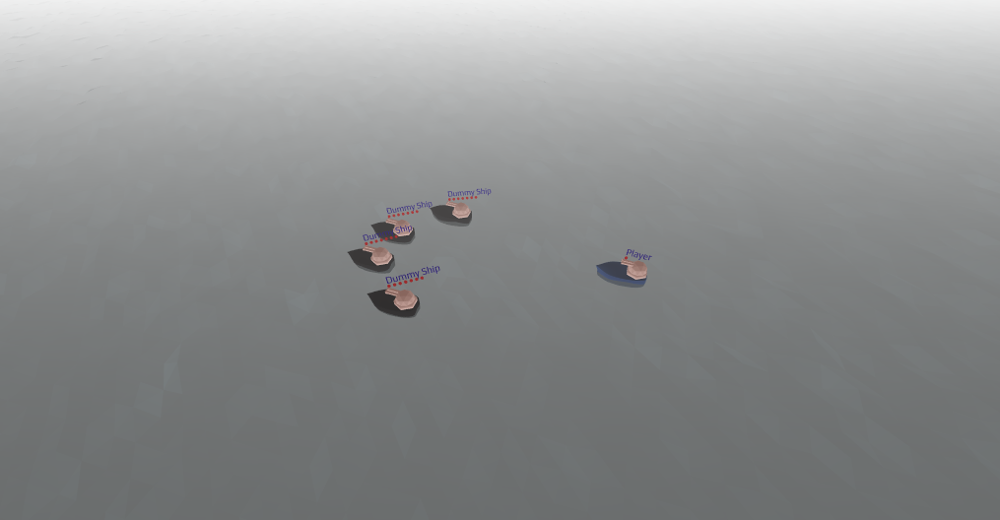

# Welcome to Battleship

Battleship is an extensible naval strategy game designed to teach students about Java programming. [You can watch a sample battle here.](https://mimirhq.github.io/davyjoneslocker/?code=mimir%2F-L777DgsqR5EkBYBFGDy)

## Getting Started

[Read this guide](start.md) to get set up with Battleship.

## Battleship API

[Read this guide](api.md) to learn how to play Battleship.

## About

Battleship is an open source project created by the Illinois Institute of Technology's Exelon Summer Institute. This fork is maintained by Mimir.
